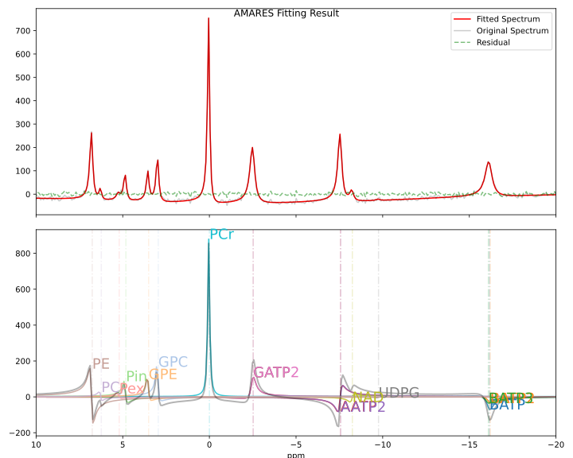
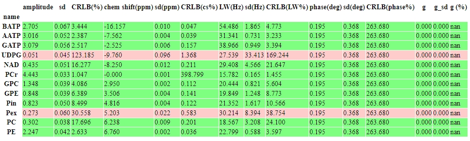

Getting Started - A Simple Example
==================================

.. note:: 
   PyAMARES can function as a standalone program or be integrated into users' existing Python MRS processing pipelines. We recommend using pyAMARES in Jupyter notebooks for greater flexibility. However, you can also copy and edit ``./pyAMARES/pyAMARES/script/amaresfit.py`` according to your needs.

Run pyAMARES
------------

.. only:: html

   .. tabs::

      .. tab:: Jupyter Notebook

         Run pyAMARES in a Jupyter Notebook:

         **Try Jupyter Notebook on Google Colab** `here <https://colab.research.google.com/drive/184_7MJ6O1BgGYyqNvnXXqtri4_0N4ySw?usp=sharing>`_

         .. code-block:: python

            import pyAMARES
            # Load FID from a 2-column ASCII file, and set the MR parameters
            MHz = 120.0  # 31P nuclei at 7T
            sw = 10000  # spectrum width in Hz
            deadtime = 300e-6  # 300 us begin time for the FID signal acquisition

            fid = pyAMARES.readmrs('./docs/source/notebooks/attachment/fid.txt')
            # Load Prior Knowledge
            FIDobj = pyAMARES.initialize_FID(fid=fid, 
                                             priorknowledge='./docs/source/notebooks/attachment/example_human_brain_31P_7T.csv',
                                             MHz=MHz, 
                                             sw=sw,
                                             deadtime=deadtime, 
                                             preview=False,
                                             normalize_fid=False,
                                             xlim=(10, -20))# Region of Interest for visualization, -20 to 10 ppm)

            # Initialize the parameter using the Levenberg-Marquardt method
            out1 = pyAMARES.fitAMARES(fid_parameters=FIDobj,
                                      fitting_parameters=FIDobj.initialParams,
                                      method='leastsq',
                                      ifplot=False)

            # Fitting the MRS data using the optimized parameter

            out2 = pyAMARES.fitAMARES(fid_parameters=out1,
                                      fitting_parameters=out1.fittedParams,  # optimized parameter from last step
                                      method='least_squares',
                                      ifplot=False)
   
            # Save the data
            out2.styled_df.to_html('simple_example.html')  # Save highlighted table to an HTML page
                                                           # Python 3.6 does not support to_html.
            out2.result_sum.to_csv('simple_example.csv')   # Save table to CSV spreadsheet
            out2.plotParameters.lb = 2.0  # Line Broadening factor for visualization
            out2.plotParameters.ifphase = True  # Phase the spectrum for visualization
            pyAMARES.plotAMARES(fid_parameters=out1, filename='simple_example.svg')  # Save plot to SVG

      .. tab:: Standalone Script

         Run pyAMARES as a standalone script:

         .. code-block:: bash

            amaresFit -f ./docs/source/notebooks/attachment/fid.txt -p ./docs/source/notebooks/attachment/example_human_brain_31P_7T.csv --MHz 120.0 --sw 10000 --deadtime 300e-6 --ifplot --xlim 10 -20 -o simple_example

         The usage of the pyAMARES command ``ahmaresFit`` is:

         .. code-block:: none

            $ amaresFit -h
            Current pyAMARES version is 0.2.100
            Author: Jia Xu, MR Research Facility, University of Iowa
            usage: amaresFit [-h] -f fid file name [-p Prior Knowledge Spreadsheet] [-o output prefix] [--MHz B0] [--sw Hz] [--deadtime seconds]
                           [--normalize_fid] [--flip_axis] [--ifphase] [--lb float] [--preview] [--carrier ppm]
                           [--truncate_initial_points number of points] [--g_global float g for all peaks] [--ppm_offset offset in ppm]
                           [--xlim xmin xmax] [--use_hsvd] [--num_of_component number of components] [--method leastsq or least_squares] [--ifplot]

            PyAMARES Command Line Interface

            optional arguments:
            -h, --help            show this help message and exit
            -f fid file name, --fid_data fid file name
                                    Path to the FID file in CSV, TXT, NPY, or Matlab format
            -p Prior Knowledge Spreadsheet, --priorknowledgefile Prior Knowledge Spreadsheet
                                    Path to xlsx or csv file containing prior knowledge parameters
            -o output prefix, --output output prefix
                                    prefix of saved html report and images
            --MHz B0              The field strength in MHz
            --sw Hz               The spectral width in Hz
            --deadtime seconds    The dead time or begin time before the FID signal starts
            --normalize_fid       Normalize the FID data
            --flip_axis           Flip the FID axis by taking the complex conjugate
            --ifphase             Phase the plotAMARES spectrum
            --lb float            Line Broadening factor in Hz for plotAMARES
            --preview             Display a preview plot of the original and initialized FID spectra
            --carrier ppm         The carrier frequency
            --truncate_initial_points number of points
                                    Truncate initial points from FID to remove fast decaying components (e.g. macromolecule).
            --g_global (float) g for all peaks
                                    Global value for the 'g' parameter in prior knowledge
            --ppm_offset offset in ppm
                                    Adjust the chemical shift in prior knowledge file
            --xlim xmin xmax      The x-axis limits for the preview plot in ppm
            --use_hsvd            Use HSVD for initial parameter generation
            --num_of_component number of components
                                    Number of components for HSVD decomposition
            --method leastsq or least_squares
                                    Fitting method, leastsq (Levenberg-Marquardt Method) or least_squares (default,Trust Region Reflective Method)

            
         You can also copy ``pyAMARES/script/amaresfit.py`` and edit it yourself.

.. only:: not html

   Run pyAMARES as standard-alone script
   -------------------------------------

   .. code-block:: bash

      amaresFit -f ./pyAMARES/examples/fid.txt -p  ./pyAMARES/examples/example_human_brain_31P_7T.csv --MHz 120.0 --sw 10000 --deadtime 300e-6 --ifplot --xlim 10 -20 -o simple_example 

      The usage of the pyAMARES command ``ahmaresFit`` is:

      .. code-block:: none

         $ amaresFit -h
         Current pyAMARES version is 0.3.0
         Author: Jia Xu, MR Research Facility, University of Iowa
         usage: amaresFit [-h] -f fid file name [-p Prior Knowledge Spreadsheet] [-o output prefix] [--MHz B0] [--sw Hz] [--deadtime seconds]
                        [--normalize_fid] [--flip_axis] [--ifphase] [--lb float] [--preview] [--carrier ppm]
                        [--truncate_initial_points number of points] [--g_global float g for all peaks] [--ppm_offset offset in ppm]
                        [--xlim xmin xmax] [--use_hsvd] [--num_of_component number of components] [--method leastsq or least_squares] [--ifplot]

         PyAMARES Command Line Interface

         optional arguments:
         -h, --help            show this help message and exit
         -f fid file name, --fid_data fid file name
                                 Path to the FID file in CSV, TXT, NPY, or Matlab format
         -p Prior Knowledge Spreadsheet, --priorknowledgefile Prior Knowledge Spreadsheet
                                 Path to xlsx or csv file containing prior knowledge parameters
         -o output prefix, --output output prefix
                                 prefix of saved html report and images
         --MHz B0              The field strength in MHz
         --sw Hz               The spectral width in Hz
         --deadtime seconds    The dead time or begin time before the FID signal starts
         --normalize_fid       Normalize the FID data
         --flip_axis           Flip the FID axis by taking the complex conjugate
         --ifphase             Phase the plotAMARES spectrum
         --lb float            Line Broadening factor in Hz for plotAMARES
         --preview             Display a preview plot of the original and initialized FID spectra
         --carrier ppm         The carrier frequency
         --truncate_initial_points number of points
                                 Truncate initial points from FID to remove fast decaying components (e.g. macromolecule).
         --g_global (float) g for all peaks
                                 Global value for the 'g' parameter in prior knowledge
         --ppm_offset offset in ppm
                                 Adjust the chemical shift in prior knowledge file
         --xlim xmin xmax      The x-axis limits for the preview plot in ppm
         --use_hsvd            Use HSVD for initial parameter generation
         --num_of_component number of components
                                 Number of components for HSVD decomposition
         --method leastsq or least_squares
                                 Fitting method, leastsq (Levenberg-Marquardt Method) or least_squares (default,Trust Region Reflective Method)

         
      You can also copy ``pyAMARES/script/amaresfit.py`` and edit it yourself.

   Run pyAMARES in a Jupyter Notebook
   ----------------------------------

   **Try Jupyter Notebook on Google Colab** `here <https://colab.research.google.com/drive/184_7MJ6O1BgGYyqNvnXXqtri4_0N4ySw?usp=sharing>`_

   .. code-block:: python

      import pyAMARES
      # Load FID from a 2-column ASCII file, and set the MR parameters
      MHz = 120.0  # 31P nuclei at 7T
      sw = 10000  # spectrum width in Hz
      deadtime = 300e-6  # 300 us begin time for the FID signal acquisition

      fid = pyAMARES.readmrs('./docs/source/notebooks/attachment/fid.txt')
      # Load Prior Knowledge
      FIDobj = pyAMARES.initialize_FID(fid=fid, 
                                       priorknowledge='./docs/source/notebooks/attachment/example_human_brain_31P_7T.csv',
                                       MHz=MHz, 
                                       sw=sw,
                                       deadtime=deadtime, 
                                       preview=False,
                                       normalize_fid=False,
                                       xlim=(10, -20))# Region of Interest for visualization, -20 to 10 ppm)

      # Initialize the parameter using the Levenberg-Marquardt method
      out1 = pyAMARES.fitAMARES(fid_parameters=FIDobj,
                           fitting_parameters=FIDobj.initialParams,
                           method='leastsq',
                           ifplot=False)

      # Fitting the MRS data using the optimized parameter

      out2 = pyAMARES.fitAMARES(fid_parameters=out1,
                           fitting_parameters=out1.fittedParams,  # optimized parameter from last step
                           method='least_squares',
                           ifplot=False)

      # Save the data
      out2.styled_df.to_html('simple_example.html')  # Save highlighted table to an HTML page
                                                # Python 3.6 does not support to_html.
      out2.result_sum.to_csv('simple_example.csv')   # Save table to CSV spreadsheet
      out2.plotParameters.lb = 2.0  # Line Broadening factor for visualization
      out2.plotParameters.ifphase = True  # Phase the spectrum for visualization
      pyAMARES.plotAMARES(fid_parameters=out1, filename='simple_example.svg')  # Save plot to SVG

   
Fitting Result
--------------

Prior Knowledge Spreadsheet
---------------------------

.. csv-table:: An Example Prior Knowledge Spreadsheet
   :file: notebooks/attachment/sample.csv
   :header-rows: 2 

Spreadsheet Format
^^^^^^^^^^^^^^^^^^

- **Index Column**: Always use the terms ``amplitude``, ``chemicalshift``, ``linewidth``, ``phase``, and ``g`` as index labels in the spreadsheet for both initial values and constraints.

- **Setup Constraints**:
   - Constraints are set using brackets. For example, ``(-180, 180)`` indicates a range from -180 to 180.
   - If only a lower bound is needed, omit the second half of the bracket. For example, ``(0,`` specifies a range of 0 and above.

- **Physical Units**:
    - In the spreadsheet, the values for ``amplitude`` and ``g`` are unitless. ``chemicalshift`` is measured in ppm, ``linewidth`` in Hz, and ``phase`` in degrees.

- **Peak Name Suffix:**

   - To set up a multiplet, designate the main sublet peak using ASCII letters, and define other sublets by adding numeric suffixes to the main peak name. For instance, the triplet for β-ATP is labeled ``BATP``, ``BATP2``, and ``BATP3``.

   Therefore, numbers are not allowed in other peak names.

   Similarly, the doublet for γ-ATP is labeled ``GATP`` and ``GATP2``.

- **Constraints for Multiplets:**

   - Parameters can be constrained using mathematical expressions, which is especially useful for multiplet setups.

   - Multiplets separated by J-coupling share parameters like phase and linewidth (LW). Constraints for these can be linked to the main peak name; for example, ``BATP`` in the LW and phase rows.

   - The chemicalshifts of sublets can be constrained relative to the main peak using its peak name and the J-coupling constants. For example, ``BATP-15Hz`` indicates the chemicalshift is set 15 Hz lower than that of β-ATP. If ppm is used, it will be converted to Hz using the MHz argument.

   - The amplitude of sublets can be related to the main peak. For instance, with β-ATP as a triplet having 1:2:1 amplitude ratios, the amplitude constraints for the sublets could be set as ``BATP/2``. Similarly, for γ-ATP, where two sublets have a 1:1 amplitude ratio, the amplitude can be set as ``GATP``.

   - Since the prior knowledge dataset spreadsheet is parsed from left to right, the peak that will be mathematically constrained to it must always be put to the left of the peaks that will be constrained. For example, for the multiplets, the main peak, such as ``BATP``, will always be put to the left of ``BATP2`` or ``BATP3``, whose amplitude constraints will be fixed as ``BATP/2``.

- **Comments**

   - Comments can be added to the prior knowledge spreadsheet (CSV or XLSX) with lines trailing ``#``.

   - In the spreadsheet in CSV format, comments **cannot** be added to the first rows.

.. note::
   See :doc:`Tutorial <notebooks/priorknowledge>` for more details on how to import a prior knowledge spreadsheet using pyAMARES.

