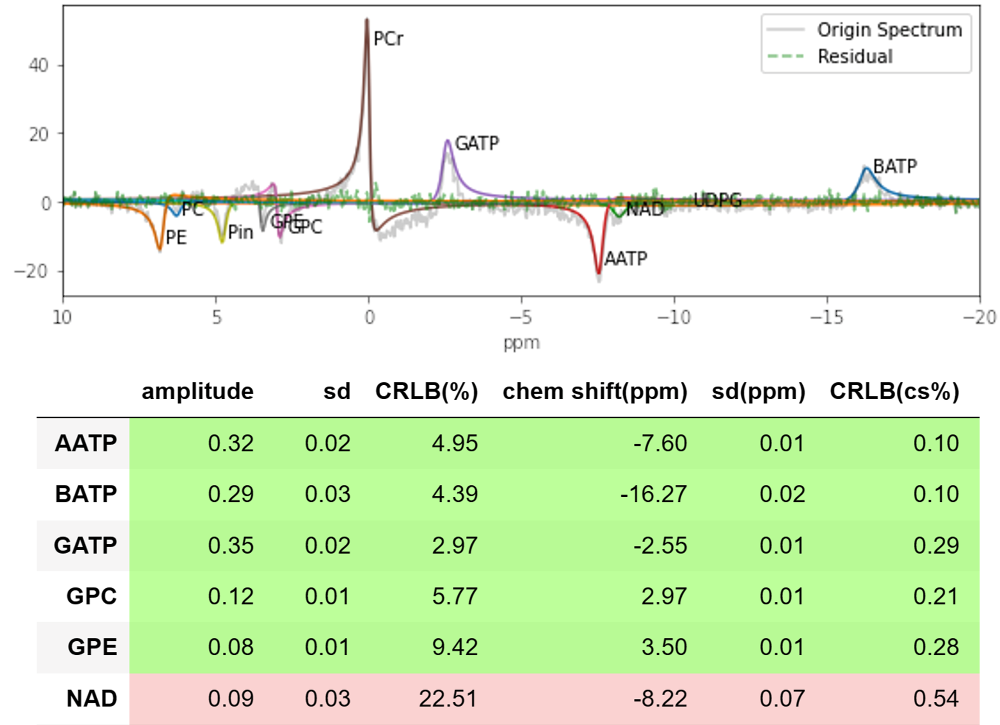

What is pyAMARES?
_________________

PyAMARES package to provide the MRS community with open-source, easy-to-use MRS fitting method in Python.  
It imports prior knowledge from Excel or CSV spreadsheets as initial values and constraints for fitting MRS data according to the AMARES model function. 

PyAMARES fits MRS data to the AMARES model function : 

.. math::
    y_n = \hat{y}_n + e_n = \sum_{k=1}^{K} a_k e^{j\phi_k} e^{-d_k (1-g_k+g_k t_n)} t_n e^{j2\pi f_k t_n} + e_n, \quad n = 0,1,...,N - 1.

The parameters :math:`a_k` (amplitude), :math:`f_k` (frequency), :math:`d_k` (damping factor), :math:`\phi_k` (phase), and :math:`g_k` (lineshape) can be fitted or fixed by pyAMARES as needed.
